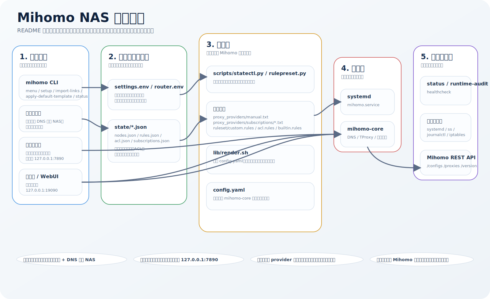
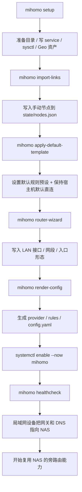
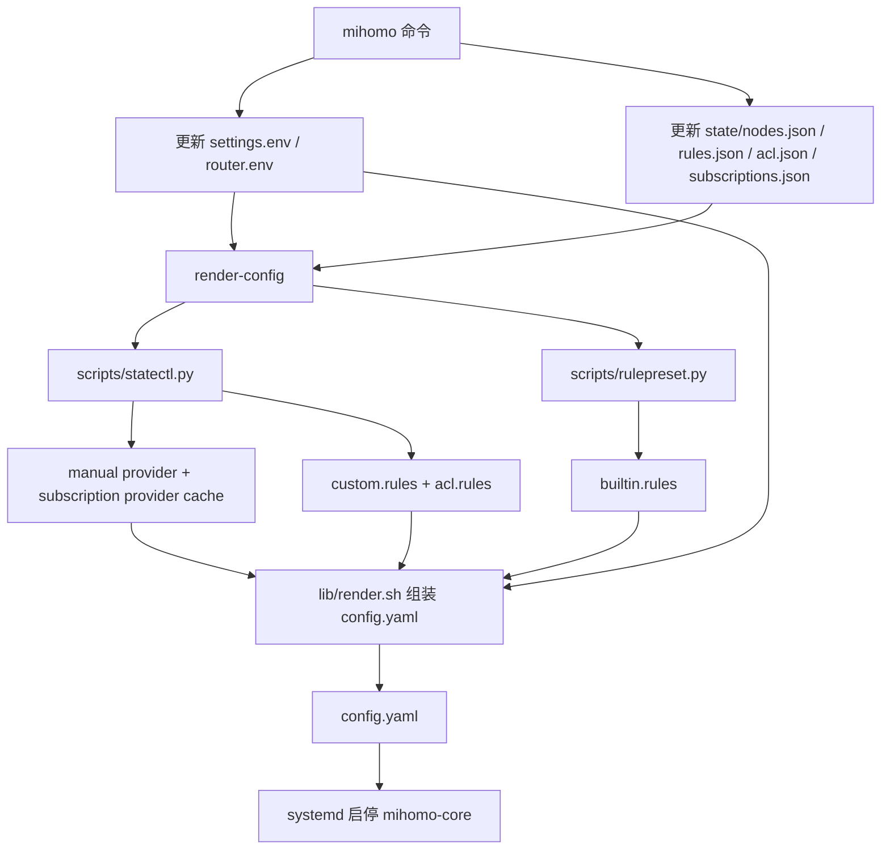
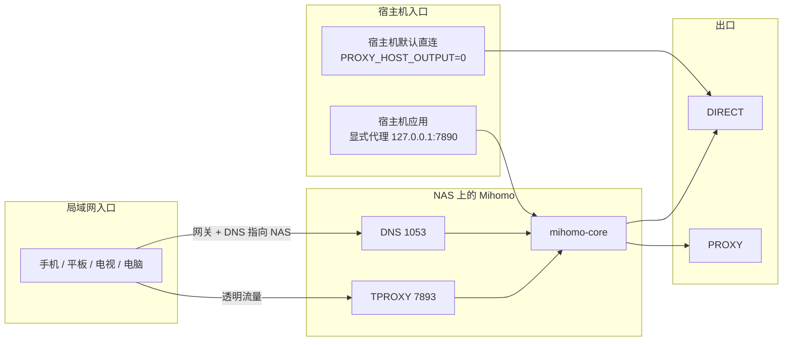
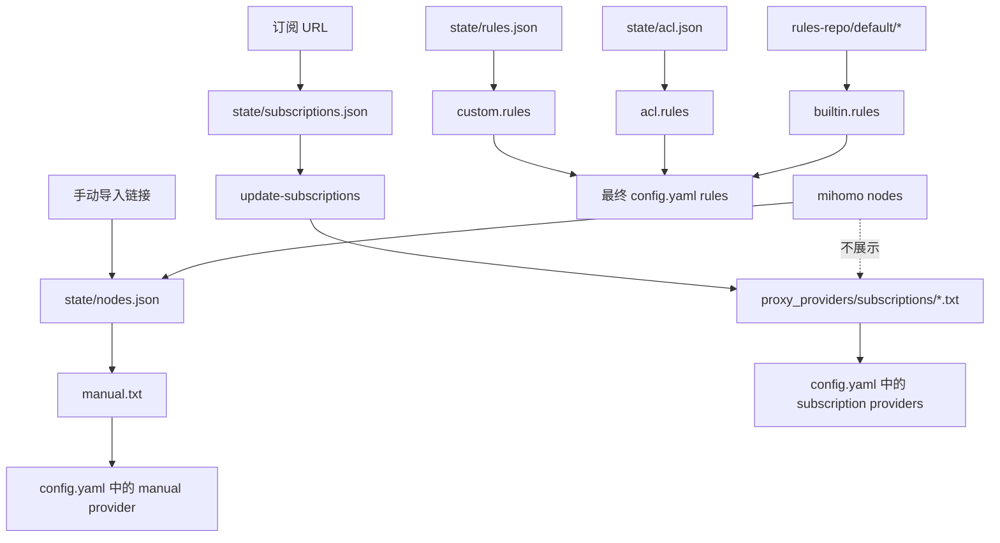

# 项目流程图

本文件补充 README 中的“项目总览图”，方便首次接触本项目的人快速理解：

- 项目是怎么从命令入口走到运行配置和 `mihomo-core`
- 局域网设备、宿主机显式代理、控制面分别怎么接入
- 手动节点、订阅 provider、规则和状态文件分别扮演什么角色
- `status` / `healthcheck` / `runtime-audit` 实际读的是真相还是运行态

## 1. 项目总览

<p align="center">
  
</p>

## 2. 首次部署与使用闭环



关键点：

- `setup` 负责安装侧准备，不等于已经有可用节点。
- `import-links` 主要导入“手动节点真相”。
- `apply-default-template` 只收口默认规则和宿主机直连策略，不强改当前网络拓扑。
- 真正让局域网开始走旁路由，发生在“设备把网关和 DNS 指向 NAS”之后。

## 3. 配置渲染与服务启动链



关键点：

- `settings.env` / `router.env` 是静态部署意图。
- `state/*.json` 是本项目自己的状态真相。
- `proxy_providers/subscriptions/*.txt` 是订阅 provider 输入真相，不再把订阅节点重新并回手动节点列表。

## 4. 局域网旁路由与显式代理数据流



关键点：

- 当前默认只承诺 IPv4 旁路由。
- 宿主机默认不透明接管，避免误伤 SSH、隧道与 NAS 本机业务。
- 宿主机应用如需走代理，走显式代理端口，而不是依赖宿主机透明接管。

## 5. 手动节点、订阅 provider 与规则真相



关键点：

- `mihomo nodes` 只展示手动节点，不把订阅缓存节点混进主交互路径。
- ACL / 自定义规则的具名目标只允许指向手动节点。
- 订阅链路的目标是生成 provider 输入，而不是生成新的“本地可编辑节点真相”。

## 6. 运行态读取与诊断链

```mermaid
flowchart TD
    A[mihomo status] --> D
    B[mihomo runtime-audit] --> D
    C[mihomo healthcheck] --> E

    D[读取 Mihomo REST API] --> F[/configs]
    D --> G[/proxies]
    D --> H[/version]

    A --> I[读取 settings.env / router.env / config.yaml]
    B --> J[读取 systemd / journalctl / iptables / ss]
    C --> K[检查端口监听 / WebUI / 显式代理探测]

    F --> L[当前模式]
    G --> M[最小策略组运行态摘要]
    H --> N[控制面运行态摘要]
```

关键点：

- `status` / `runtime-audit` 的“当前模式”和最小策略组摘要优先读 Mihomo 运行态，不再只看本地文件。
- 控制面不可达时会回退到本地配置或显示“未获取”，避免整个状态页失效。
- `healthcheck` 更偏“当前服务能不能用”，`runtime-audit` 更偏“最近有没有异常、链路是否健康”。
